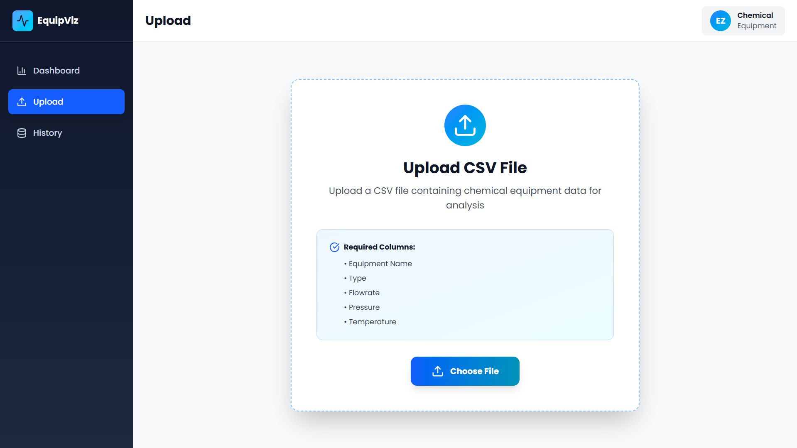
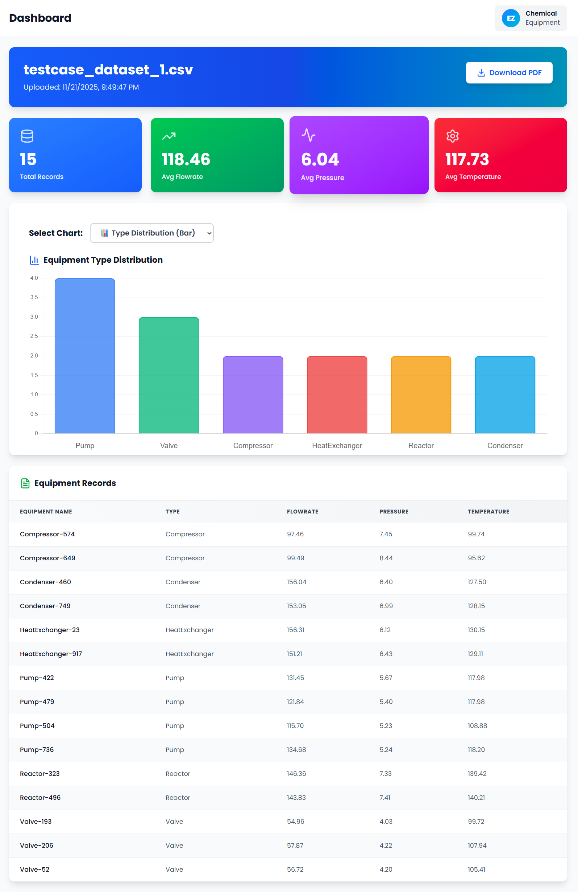
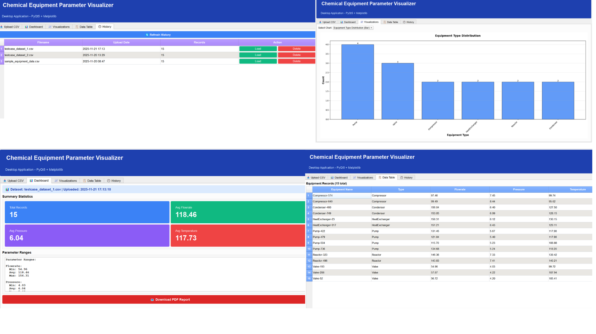

# Chemical Equipment Parameter Visualizer 🧪


A **hybrid web and desktop application** for visualizing and analyzing chemical equipment parameters. Built with Django REST Framework backend, React web frontend, and PyQt5 desktop application with Matplotlib visualizations.

## 🌟 Features

### 🌐 Web Application (React)
- **Modern UI** with responsive design
- **Interactive dashboards** with real-time data
- **Chart.js visualizations** for equipment analysis
- **CSV upload** with drag & drop
- **PDF report generation**

### 🖥️ Desktop Application (PyQt5)
- **Native desktop experience** for Windows, macOS, Linux
- **Matplotlib integration** for publication-quality charts
- **Offline-capable** with local data processing
- **Rich GUI** with tabbed interface
- **File system integration** for easy data management
- **Professional visualizations** with multiple chart types

### 🔧 Backend (Django REST API)
- **RESTful API** serving both frontends
- **Pandas-powered** data analysis
- **SQLite database** for persistent storage
- **History management** - stores last 5 datasets
- **Authentication support**
- **Automatic data validation**

## 📸 Screenshots

### Upload Interface


### Dashboard View


### Desktop View


## 🛠️ Tech Stack

| Layer | Technology | Purpose |
|-------|-----------|---------|
| **Frontend (Web)** | React 18.2 + Chart.js | Interactive web UI |
| **Frontend (Desktop)** | PyQt5 5.15 + Matplotlib | Native desktop application |
| **Backend** | Django 4.2 + DRF | REST API server |
| **Data Processing** | Pandas 2.1 | CSV analysis & statistics |
| **Database** | SQLite | Data persistence |
| **PDF Generation** | ReportLab | Professional reports |
| **HTTP Client** | Requests | Desktop-to-API communication |

## 🚀 Project Setup

#### 1️⃣ Backend (Django)
```bash
cd backend
python -m venv venv
source venv/bin/activate  # On Windows: venv\Scripts\activate.ps1
pip install -r requirements.txt
cd chemical_equipment
python manage.py migrate
python manage.py runserver
```

#### 2️⃣ Web Frontend (React)
```bash
cd frontend
npm install
npm start
```

#### 3️⃣ Desktop Application (PyQt5)
```bash
cd desktop
python -m venv venv
source venv/bin/activate  # On Windows: venv\Scripts\activate.ps1
pip install -r requirements.txt
python main.py
```

### 🎯 Access Applications

- **Backend API**: http://localhost:8000/api/
- **Web App**: http://localhost:3000
- **Admin Panel**: http://localhost:8000/admin/
- **Desktop App**: Launch via `python main.py`

## 📊 Sample Data

A sample CSV file is provided in the repository: `sample_equipment_data.csv`

**Required CSV Format:**
```csv
Equipment Name,Type,Flowrate,Pressure,Temperature
Reactor-A1,Reactor,150.5,25.3,220.0
Heat Exchanger-B2,Heat Exchanger,200.0,15.8,180.5
...
```

## 🔐 Authentication

### Using Django Admin
1. Navigate to `http://localhost:8000/admin/`
2. Login with superuser credentials
3. Session authentication will be active

### API Access
- Session-based authentication
- Token authentication (optional)

## 📡 API Endpoints

| Method | Endpoint | Description |
|--------|----------|-------------|
| GET | `/api/datasets/` | List last 5 datasets |
| POST | `/api/datasets/upload/` | Upload CSV file |
| GET | `/api/datasets/{id}/` | Get dataset details |
| GET | `/api/datasets/{id}/generate_pdf/` | Download PDF report |

## 🎨 UI Components

### Web Application (React)
<table>
<tr>
<td width="50%">

**Dashboard**
- Summary statistics cards
- Equipment type distribution charts
- Parameter range visualizations
- Interactive data tables

</td>
<td width="50%">

**Features**
- Real-time chart updates
- Responsive design
- Mobile-friendly
- Modern UI with Tailwind

</td>
</tr>
</table>

### Desktop Application (PyQt5)
<table>
<tr>
<td width="50%">

**Tabs**
- 📤 Upload CSV
- 📊 Dashboard
- 📈 Visualizations
- 📋 Data Table
- 🕐 History

</td>
<td width="50%">

**Charts**
- Bar charts (equipment types)
- Pie charts (distribution)
- Multi-parameter comparisons
- Publication-quality exports

</td>
</tr>
</table>

## 🖥️ Desktop Application (PyQt5)

Coming soon! Desktop version with:
- Native OS integration
- Offline functionality
- Matplotlib-based visualizations
- Same backend API

## 📁 Project Structure

```
chemical-equipment-visualizer/
├── backend/                    # Django REST API
│   ├── chemical_equipment/     # Project settings
│   ├── equipment/              # Main app
│   ├── media/                  # Uploaded files
│   ├── manage.py
│   └── requirements.txt
├── frontend/                   # React Web App
│   ├── src/
│   │   ├── App.js             # Main component
│   │   └── index.js
│   ├── package.json
│   └── ...
├── desktop/                    # PyQt5 Desktop App
│   ├── main.py                # Main application
│   ├── requirements.txt
│   
│   
├── sample_equipment_data.csv   # Test data
├── .gitignore
├── README.md
└── SETUP.md                    # Detailed setup guide
```